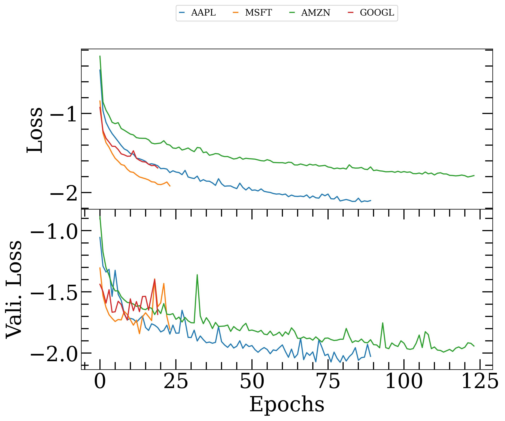

# DISCLAIMER: 
Stock market predictions and financial analyses provided by this code are for informational purposes only and should not be considered as investment advice. The information, analyses, and predictions generated by this code are based on historical data, technical indicators, and machine learning models, which do not guarantee future performance or accuracy. Use of this code and any decision made based on its output is at your own risk. Trading and investing in the financial markets involves significant risk, and it's important to conduct thorough research, exercise caution, and consider seeking advice from a qualified financial advisor before making any investment decisions. The author(s) of this code are not responsible for any financial losses, gains, or decisions made based on the information provided by this code. Past performance is not indicative of future results, and predictions made by this code may not be accurate or reliable. This code is provided as-is without any warranty. Users are solely responsible for their own decisions and actions taken based on the information obtained from this code. Please perform your own due diligence and be aware of the risks involved in financial markets before making any investment decisions.


# Stock market predictions using Bayesian LSTM networks

The main idea behind this repo is to predict stock market up to several weeks in advance using daily trends. It combines differents stock from a one sector into one combined model. This serves as a starting point to train each stock indivudually. End results are far better that predictions from a single stock.

# Usage all options

```command
usage: main.py [-h] [--tickers [TICKERS ...]] [--start_date START_DATE] [--end_date END_DATE] [--validation_days VALIDATION_DAYS] [--epochs EPOCHS] [--layers LAYERS]
               [--input_time_steps INPUT_TIME_STEPS] [--output_time_steps OUTPUT_TIME_STEPS] [--batch_size BATCH_SIZE] [--lr LR] [--output_dir OUTPUT_DIR]
```

# Example output from the following command
```command
python main.py --output_dir tech_stocks --tickers 'MSFT' 'AAPL' 'AMZN' 'GOOGL' 'META'
```

# Output..
```command
tickers =  ['MSFT', 'AAPL', 'AMZN', 'GOOGL', 'META']
dates (start, end, validation) 2018-11-08 2023-11-07 2022-11-07
epochs, lr, batch_size layers =  1000 1e-04 32 4
time steps (input, output) =  120 120
Directory 'tech_stocks/' created successfully. 
[*********************100%%**********************]  1 of 1 completed
tech_stocks/MSFT.csv
[*********************100%%**********************]  1 of 1 completed
tech_stocks/AAPL.csv
[*********************100%%**********************]  1 of 1 completed
tech_stocks/AMZN.csv
[*********************100%%**********************]  1 of 1 completed
tech_stocks/GOOGL.csv
[*********************100%%**********************]  1 of 1 completed
tech_stocks/META.csv
```


## Training and validation samples
```command
Train all stocks as one combined model but training in sequentially..<br>
new/AMZN.csv<br>
train dataset <bound method DataFrame.info of<br>
```

| index |Date   |     Open    |    High     |    Low     |  Close  | Adj Close |     Volume|
| -------- | -------- | -------- | -------- | -------- | -------- | -------- | -------- |
|0     |2018-11-08|   87.750000   |89.199997   |86.255501   |87.745499   |87.745499  |130698000|
|1004  |2022-11-04|   91.489998   |92.440002   |88.040001   |90.980003   |90.980003  |129101300|

[1005 rows x 7 columns]><br>
test dataset <bound method DataFrame.info of<br>

| index |Date   |     Open    |    High     |    Low     |  Close  | Adj Close |     Volume|
| -------- | -------- | -------- | -------- | -------- | -------- | -------- | -------- |
| 1005 |  2022-11-07 |  91.949997 |   92.099998 |  89.040001 |   90.529999 |   90.529999 |   77495700 |
| 1255 |  2023-11-06 |  138.759995|  140.729996 | 138.360001 | 139.740005 | 139.740005 |  44928800 |

[251 rows x 7 columns]><br>
train/val samples  (1016, 120, 5) (1016, 120) (11, 120, 5) (11, 120)<br>

```command
## Model summary, using same architecture for each stock
Model: "model"
_________________________________________________________________
 Layer (type)                Output Shape              Param #   
=================================================================
 input_1 (InputLayer)        [(None, 120, 5)]          0         
                                                                 
 LSTMLayer1 (Bidirectional)  (None, 120, 240)          120960    
                                                                 
 LSTMLayer2 (Dropout)        (None, 120, 240)          0         
                                                                 
 LSTMLayer3 (Bidirectional)  (None, 120, 240)          346560    
                                                                 
 LSTMLayer4 (Dropout)        (None, 120, 240)          0         
                                                                 
 LSTMLayer5 (Bidirectional)  (None, 120, 240)          346560    
                                                                 
 LSTMLayer6 (Dropout)        (None, 120, 240)          0         
                                                                 
 LSTMLayer7 (Bidirectional)  (None, 240)               346560    
                                                                 
 LSTMLayer8 (Dropout)        (None, 240)               0         
                                                                 
 dense (Dense)               (None, 240)               57840     
                                                                 
 dist (DistributionLambda)   ((None, 120),             0         
                              (None, 120))                       
                                                                 
=================================================================<br>
Total params: 1,218,480<br>
Trainable params: 1,218,480<br>
Non-trainable params: 0<br>
_________________________________________________________________<br>

## Training for a combined model using stocks data one by one<br>

_________________________________________________________________<br>

new/AMZN.csv<br>
_________________________________________________________________<br>
Epoch 1/1000
32/32 [==============================] - ETA: 0s - loss: 0.7739  
Epoch 00001: val_loss improved from inf to 0.44102, saving model to tech_stocks/models/combined_model
32/32 [==============================] - 20s 408ms/step - loss: 0.7739 - val_loss: 0.4410
..........<br>
Epoch 101/1000<br>
32/32 [==============================] - ETA: 0s - loss: -1.5346<br>
Epoch 00101: val_loss did not improve from -1.80982<br>
32/32 [==============================] - 8s 255ms/step - loss: -1.5346 - val_loss: -1.6621<br>
ticker  AMZN 13.837315817674002 [min]<br>

_________________________________________________________________<br>


new/MSFT.csv<br>
_________________________________________________________________<br>

Epoch 1/1000<br>
32/32 [==============================] - ETA: 0s - loss: 0.7634  <br>
Epoch 00001: val_loss improved from inf to 0.55485, saving model to tech_stocks/models/combined_model<br>
32/32 [==============================] - 19s 377ms/step - loss: 0.7634 - val_loss: 0.5549<br>
.........<br>
Epoch 66/1000<br>
32/32 [==============================] - ETA: 0s - loss: -1.7582<br>
Epoch 00066: val_loss did not improve from -1.74426<br>
32/32 [==============================] - 8s 247ms/step - loss: -1.7582 - val_loss: -1.6977<br>
ticker  MSFT 8.743007981777192 [min]<br>

runs rest of the stocks....<br>

## Now train each model again using combined model as a starting point. <br>
_________________________________________________________________.<br>
Epoch 1/1000.<br>
32/32 [==============================] - ETA: 0s - loss: 0.7858  .<br>
Epoch 00001: val_loss improved from inf to 0.61471, saving model to tech_stocks/models/AAPL_model.<br>
32/32 [==============================] - 21s 447ms/step - loss: 0.7858 - val_loss: 0.6147.<br>
...........<br>
Epoch 126/1000.<br>
32/32 [==============================] - ETA: 0s - loss: -1.9969.<br>
Epoch 00126: val_loss did not improve from -1.90743.<br>
32/32 [==============================] - 8s 249ms/step - loss: -1.9969 - val_loss: -1.8522.<br>
tech_stocks/models/AAPL_model.<br>


...........................<br>

and the rest of the stocks<br>


new/models/MSFT_model <br>
input shape  (10, 120, 5) <br>

predicting using model file new/models/MSFT_model <br>
prediction file name  new/MSFT_pred.npy <br>
ticker  MSFT 7.256359632809957 [min] <br>
...........................<br>
and the rest of the stocks<br>
total time [min] =  67.62601785262426 <br>
```

## Train/validation losses assuming normal distribution at the output




## Predictions including the last 120 days a extrapolation from the current trend <br>


